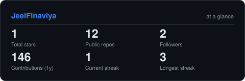
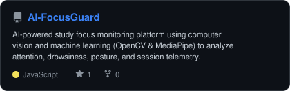
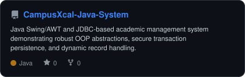
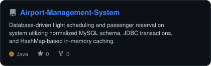
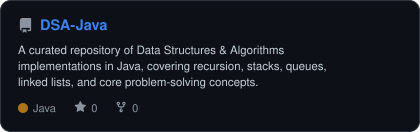

  
  
    

  <!-- PORTRAIT - generated by scripts/dotify.py from me_transparent.png -->
  

    
  
  <!-- NAME / TAGLINE - animated typing -->
  
    

  <!-- SOCIAL BADGES -->
  
  &nbsp;
  
  &nbsp;
  
  &nbsp;
  
  
    
  

 

---

## 👨💻 About Me

<table align="center" width="100%" border="0">
  <tr>
    <td width="50%" valign="top">
      <h3>🎓 Education</h3>
      

        <b>B.Tech in Computer Science & IT</b> 
        <i>LJ University, Ahmedabad, Gujarat</i> (2024 - 2028) 
        <strong>CGPA: 9.44 / 10.00</strong> (4th Semester)
      

      

        Currently focusing on mastering core computer science subjects, including Data Structures & Algorithms, Database Management Systems (DBMS), and Object-Orient Oriented Programming (OOP) principles.
      

    </td>
    <td width="50%" valign="top" style="padding-left: 20px;">
      <h3>🔎 Core Focus</h3>
      <ul>
        <li><b>Full Stack Development</b>: Building scalable and interactive React web applications backed by solid APIs.</li>
        <li><b>AI & Computer Vision</b>: Creating applications utilizing OpenCV, MediaPipe, and machine learning models.</li>
        <li><b>Problem Solving</b>: Strengthening algorithmic efficiency and problem-solving skills in Java & Python.</li>
        <li><b>Backend & Systems</b>: Designing clean REST APIs using Node.js/Express.js and Django REST Framework.</li>
      </ul>
    </td>
  </tr>
</table>

---

## 🛠️ Tech Stack & Skill Radar

  
  <table>
    <tr>
      <td width="50%" align="center" valign="middle">
        <!-- Self-rated radar - edit assets/skills.json -->
        <picture>
          <source media="(prefers-color-scheme: dark)" srcset="assets/radar-dark.svg">
          <source media="(prefers-color-scheme: light)" srcset="assets/radar-light.svg">
          
        </picture>
      </td>
      <td width="50%" align="center" valign="middle">
        <!-- Live radar built from real language byte counts across your repos -->
        <picture>
          <source media="(prefers-color-scheme: dark)" srcset="assets/radar-langs-dark.svg">
          <source media="(prefers-color-scheme: light)" srcset="assets/radar-langs-light.svg">
          
        </picture>
      </td>
    </tr>
  </table>

   

  <!-- TOOLBOX STRIP -->
  

---

## 📊 Live Metrics & Activity

  <!-- 3D contribution calendar -->
  
  
   

  <!-- Snake animation -->
  <picture>
    <source media="(prefers-color-scheme: dark)" srcset="https://raw.githubusercontent.com/JeelFinaviya/JeelFinaviya/output/snake-dark.svg">
    <source media="(prefers-color-scheme: light)" srcset="https://raw.githubusercontent.com/JeelFinaviya/JeelFinaviya/output/snake.svg">
    
  </picture>
  
    

  <table align="center" width="100%">
    <tr>
      <td align="center" width="50%" valign="top">
        <!-- Self-hosted stat card -->
        <picture>
          <source media="(prefers-color-scheme: dark)" srcset="assets/card-stats-dark.svg">
          <source media="(prefers-color-scheme: light)" srcset="assets/card-stats-light.svg">
          
        </picture>
      </td>
      <td align="center" width="50%" valign="top">
        <!-- LeetCode Stats Card -->
        
      </td>
    </tr>
  </table>

---

## 🚀 Projects

### 🌟 Project Cards

  <table>
    <tr>
      <td width="50%">
        <a href="https://github.com/JeelFinaviya/AI-FocusGuard">
          <picture>
            <source media="(prefers-color-scheme: dark)" srcset="assets/card-AI-FocusGuard-dark.svg">
            <source media="(prefers-color-scheme: light)" srcset="assets/card-AI-FocusGuard-light.svg">
            
          </picture>
        </a>
      </td>
      <td width="50%">
        <a href="https://github.com/JeelFinaviya/CampusXcal-Java-System">
          <picture>
            <source media="(prefers-color-scheme: dark)" srcset="assets/card-CampusXcal-Java-System-dark.svg">
            <source media="(prefers-color-scheme: light)" srcset="assets/card-CampusXcal-Java-System-light.svg">
            
          </picture>
        </a>
      </td>
    </tr>
    <tr>
      <td width="50%">
        <a href="https://github.com/JeelFinaviya/Airport-Management-System">
          <picture>
            <source media="(prefers-color-scheme: dark)" srcset="assets/card-Airport-Management-System-dark.svg">
            <source media="(prefers-color-scheme: light)" srcset="assets/card-Airport-Management-System-light.svg">
            
          </picture>
        </a>
      </td>
      <td width="50%">
        <a href="https://github.com/JeelFinaviya/DSA-Java">
          <picture>
            <source media="(prefers-color-scheme: dark)" srcset="assets/card-DSA-Java-dark.svg">
            <source media="(prefers-color-scheme: light)" srcset="assets/card-DSA-Java-light.svg">
            
          </picture>
        </a>
      </td>
    </tr>
  </table>

### 🤖 [AI-FocusGuard](https://github.com/JeelFinaviya/AI-FocusGuard)
> **AI-Powered Attention & Study Focus Monitoring Platform**
> 
> *React.js · Node.js · Express.js · Django REST Framework · MongoDB · OpenCV · MediaPipe · Scikit-learn*

- **Real-Time Computer Vision Pipeline**: Built utilizing OpenCV and MediaPipe to calculate facial landmarks, Eye Aspect Ratio (EAR), and Mouth Aspect Ratio (MAR) for drowsiness, yawning, and head-pose monitoring.
- **Focus Score Prediction**: Trained and deployed a `RandomForestRegressor` model via Django REST Framework to predict user focus scores based on session telemetry, persisting activity records in MongoDB using Mongoose.
- **Interactive Dashboard**: Built a responsive user dashboard showing real-time focus analytics, session insights, visual alerts, and secure JWT-based authentication.

---

### 🎓 [CampusXcal Java System](https://github.com/JeelFinaviya/CampusXcal-Java-System)
> **Academic Management Desktop Application**
> 
> *Java · OOP · Java Swing/AWT · JDBC · MySQL · Java Collections Framework*

- **GUI Interface**: Designed and implemented utilizing Swing and AWT for an intuitive administrative and student interface.
- **Secure Transactional Persistence**: Configured MySQL database integration via JDBC to execute student registrations, course enrollments, and academic record-insertion transactions.
- **Robust Abstractions**: Applied solid OOP principles for role management and structured exception handling to resolve database record conflicts.

---

### ✈️ [Airport Management System](https://github.com/JeelFinaviya/Airport-Management-System)
> **Database-Driven Flight Scheduling & Reservation System**
> 
> *Java · MySQL · JDBC · OOP · Collections · In-Memory Caching*

- **Normalized Database Design**: Designed a normalized MySQL schema with relational tables, foreign key constraints, and cascading updates to ensure absolute data integrity.
- **In-Memory Caching**: Implemented a Java HashMap-based caching layer for passenger records, reducing database queries and optimizing application performance.
- **JDBC Transactions**: Created modular services to handle flight schedules, passenger profile records, and booking reservations seamlessly.

---

### 📊 [Student Performance Analysis](https://github.com/JeelFinaviya)
> **Data Processing, Visualization & Performance Prediction**
> 
> *Python · Pandas · NumPy · Matplotlib · Scikit-learn · Django*

- **Data Preprocessing**: Processed student datasets using Pandas and NumPy to clean anomalies and structure attributes.
- **Visualization & Insights**: Created visual plots using Matplotlib to map performance trends and correlation patterns.
- **ML Modeling**: Developed regression and classification targets using Scikit-learn to forecast academic performance scores.

---

### 🌐 [MERN CRUD Application](https://github.com/JeelFinaviya)
> **Full-Stack RESTful Application**
> 
> *React.js · Node.js · Express.js · MongoDB · JWT Authentication*

- **RESTful Architecture**: Developed backend routing and database transactions for CRUD operations using Express.js and MongoDB.
- **Frontend Interaction**: Integrated React.js frontend state management to perform seamless asynchronous API requests.

---

## 🧠 DSA & Problem Solving

I am actively practicing Data Structures & Algorithms to strengthen my analytical thinking and software foundations.

  
  
  
  
  
  

 

  

---

## 📜 Certifications

<table align="center" width="100%">
  <tr>
    <td align="center" width="50%">
      <b>📊 Exploratory Data Analysis for ML</b> 
      <i>IBM (Coursera)</i> · <a href="https://www.coursera.org/account/accomplishments/certificate/4EGE1C8VMWHL" target="_blank">Verify</a>
    </td>
    <td align="center" width="50%">
      <b>🌐 Introduction to HTML, CSS, & JS</b> 
      <i>IBM (Coursera)</i> · <a href="https://www.coursera.org/account/accomplishments/certificate/0MS19NYY5A8X" target="_blank">Verify</a>
    </td>
  </tr>
  <tr>
    <td align="center" width="50%">
      <b>☕ Inheritance & Data Structures in Java</b> 
      <i>University of Pennsylvania</i> · <a href="https://www.coursera.org/account/accomplishments/certificate/23QF1EK5JT7Q" target="_blank">Verify</a>
    </td>
    <td align="center" width="50%">
      <b>☕ Introduction to Java</b> 
      <i>LearnQuest (Coursera)</i> · <a href="https://www.coursera.org/account/accomplishments/certificate/KTXBNA6SAM1K" target="_blank">Verify</a>
    </td>
  </tr>
  <tr>
    <td align="center" width="50%">
      <b>🐍 Python for Data Science</b> 
      <i>IBM (Coursera)</i>
    </td>
    <td align="center" width="50%">
      <b>📈 Data Analysis with Python</b> 
      <i>IBM (Coursera)</i>
    </td>
  </tr>
  <tr>
    <td align="center" width="50%">
      <b>🤖 Machine Learning</b> 
      <i>IBM (Coursera)</i>
    </td>
    <td align="center" width="50%">
      <b>⚡ Web Development Fundamentals</b> 
      <i>IBM (Coursera)</i>
    </td>
  </tr>
</table>

---

   
  
   
  Building practical software · Strengthening fundamentals · Learning continuously
    
  

